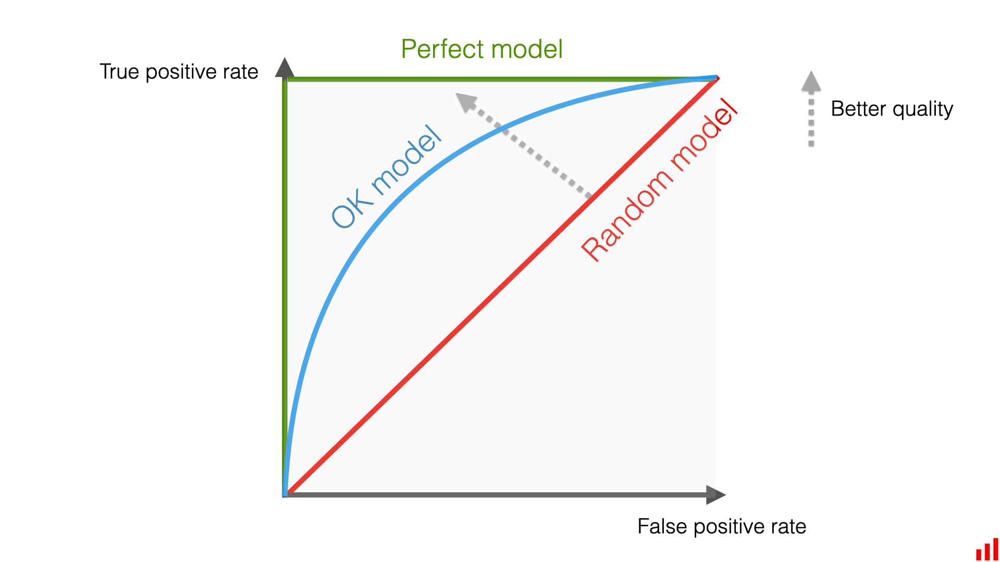

# Flood Prediction Using Machine Learning

### A machine learning project focused on building and evaluating a logistic regression model to classify flood risk based on a synthesized dataset of environmental factors.

---

## 🌊 Project Overview

This project tackles the critical task of flood prediction by applying a machine learning model. The core objective is to build a binary classification model that can predict the probability of a flood occurring based on a range of environmental and infrastructural factors. The project walks through the entire machine learning workflow, from data loading and preprocessing to model training, evaluation, and interpretation.

The primary model used is **Logistic Regression**, a foundational and highly interpretable classification algorithm. The model's performance is rigorously evaluated using key classification metrics to determine its effectiveness and limitations.

## 💾 Dataset

The analysis is based on the `flood.csv` dataset, which was sourced from Kaggle. This dataset contains numerous features that contribute to flood risk.

**Features include:**
- `MonsoonIntensity`
- `TopographyDrainage`
- `RiverManagement`
- `Deforestation`
- `Urbanization`
- `ClimateChange`
- `DamsQuality`
- And many others...

**Target Variable:**
- `FloodProbability`: A continuous value which is treated as the probability of a flood. For the classification task, this is used to derive a binary outcome (flood / no flood).

**Important Note:** A key finding during the analysis was that the dataset appears to be **synthesized**. While this makes it excellent for practicing the machine learning workflow and model optimization, the results and the model itself are not suitable for real-world flood prediction without validation on authentic, real-world data.

## ⚙️ Methodology & Approach

The project follows a structured machine learning pipeline:

1.  **Data Loading and Preprocessing**: The `flood.csv` dataset is loaded into a Pandas DataFrame. The features and target variable are identified and prepared for modeling.
2.  **Train-Test Split**: The dataset is split into training and testing sets to ensure the model is evaluated on unseen data, preventing overfitting.
3.  **Model Selection**: **Logistic Regression** was chosen as the primary model due to its simplicity, interpretability, and effectiveness as a baseline for binary classification tasks.
4.  **Model Training**: The Logistic Regression model is trained on the training dataset.
5.  **Evaluation**: The model's performance is assessed on the test set using a variety of metrics:
    * **Accuracy**: The proportion of correctly classified instances.
    * **Precision**: The ability of the model to avoid false positives.
    * **Recall**: The ability of the model to identify all actual positive cases.
    * **Log Loss**: A measure of the model's prediction accuracy based on probabilities.
    * **ROC Curve and AUC**: The Receiver Operating Characteristic (ROC) curve visualizes the trade-off between the true positive rate and false positive rate. The Area Under the Curve (AUC) provides a single score for the model's overall classification ability.

## 📊 Results & Key Findings

The trained model demonstrated a reasonable ability to classify flood risk on the synthesized data.

- **Performance Metrics**: The model achieved a **log loss of approximately 0.69**, a **recall of 0.53**, and a **precision of 0.54** on the test data.
- **ROC Curve**: The ROC curve illustrates the model's performance across different classification thresholds.



The main conclusion is that while the machine learning workflow was successfully implemented, the synthetic nature of the dataset is the primary limitation. The project serves as a strong proof-of-concept for the *process* of building a flood prediction model, rather than producing a production-ready tool.

## 🛠️ Technologies Used

This project was implemented using Python 3 and the following core libraries:
- **Pandas**: For data handling and manipulation.
- **NumPy**: For numerical computations.
- **Scikit-learn**: For implementing the Logistic Regression model, train-test split, and evaluation metrics.
- **Matplotlib**: For generating visualizations, including the ROC curve.
- **Jupyter Notebook**: For organizing and documenting the analysis.

## 🚀 How to Use

To replicate this analysis, please follow these steps:

1.  **Clone the repository:**
    ```bash
    git clone [https://github.com/your-username/Flood-Prediction-ML.git](https://github.com/your-username/Flood-Prediction-ML.git)
    cd Flood-Prediction-ML
    ```

2.  **Install the required libraries:**
    ```bash
    pip install pandas numpy scikit-learn matplotlib jupyterlab
    ```

3.  **Launch Jupyter Notebook:**
    ```bash
    jupyter lab
    ```

4.  **Open and run the notebook:**
    Open the `ML-Model-Project-2_Sushant.ipynb` file and run the cells to see the full model development and evaluation process.

## 🔮 Conclusion & Future Work

This project successfully demonstrated the end-to-end process of building a machine learning classification model for flood prediction. The main limitation identified was the synthetic dataset, which prevents the model from being used in real-world scenarios.

Future work could include:
* **Using Real-World Data**: The most critical next step is to obtain and use a real-world dataset on flood events to build a more practical and reliable model.
* **Advanced Models**: Experiment with more complex algorithms like Gradient Boosting, Random Forest, or Neural Networks to potentially improve predictive performance.
* **Feature Engineering**: Conduct more in-depth feature engineering and selection to identify the most impactful variables.
* **Optimize for Recall**: In a real-world disaster prediction scenario, minimizing false negatives (missed floods) is paramount. Future models should be optimized specifically for high recall.
